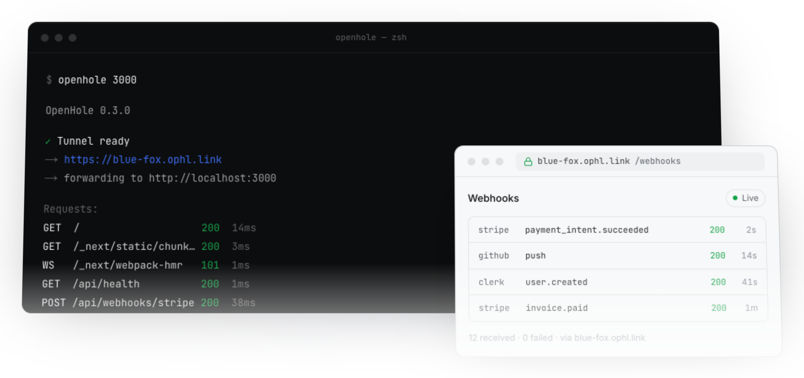
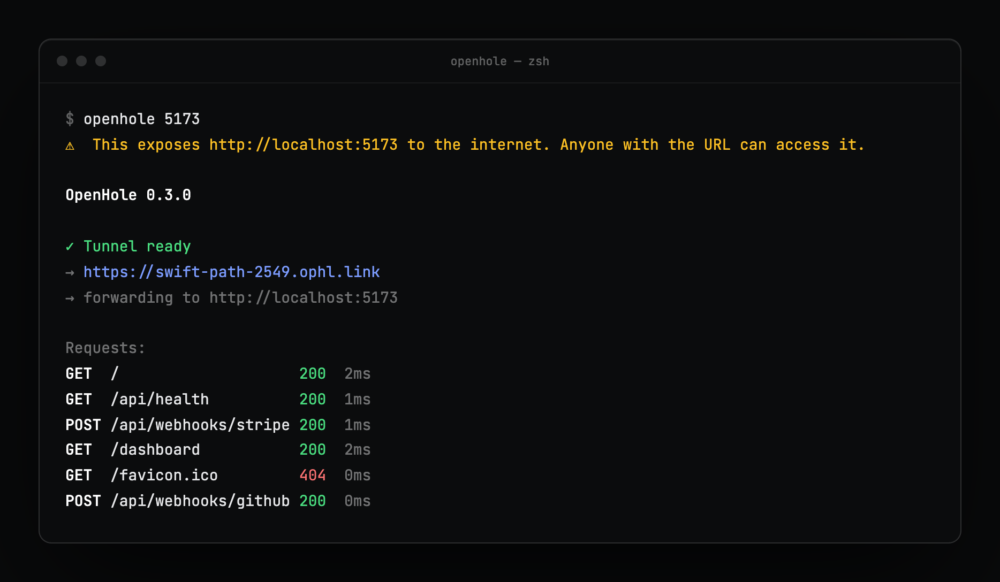
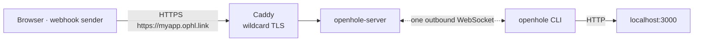

<p align="center">
  <picture>
    <source media="(prefers-color-scheme: dark)" srcset="docs/assets/logo-dark.png">
    
  </picture>
</p>

<h1 align="center">OpenHole</h1>

<p align="center">
  Expose localhost with one command.<br>
  A public HTTPS URL for any local port — no account, no dashboard, one static binary.
</p>

<p align="center">
  <a href="https://github.com/bablilayoub/openhole/releases/latest"></a>
  <a href="https://github.com/bablilayoub/openhole/actions/workflows/ci.yml"></a>
  <a href="https://goreportcard.com/report/github.com/bablilayoub/openhole"></a>
  <a href="LICENSE"></a>
</p>

<p align="center">
  <a href="https://openhole.dev">openhole.dev</a> ·
  <a href="https://openhole.dev/docs">Documentation</a> ·
  <a href="docs/self-hosting.md">Self-hosting</a> ·
  <a href="SECURITY.md">Security</a>
</p>

<p align="center">
  <picture>
    <source media="(prefers-color-scheme: dark)" srcset="docs/assets/hero-dark.png">
    
  </picture>
</p>

## Quick start

```bash
# macOS / Linux
curl -fsSL https://openhole.dev/install.sh | sh

# Windows (PowerShell)
irm https://openhole.dev/install.ps1 | iex

# Expose port 3000
openhole 3000
```

<p align="center">
  
</p>

That is the whole product. The URL works until you press <kbd>Ctrl</kbd>+<kbd>C</kbd>.

## Why OpenHole

- **No account.** Nothing to sign up for, no auth token to paste. Install, run.
- **One static binary.** Go, no runtime, no background service. macOS, Linux, Windows, amd64 and arm64.
- **WebSockets pass through.** Next.js HMR, Vite, Socket.IO and long-lived connections behave like they do on localhost.
- **Basic Auth in one flag.** `--auth user:pass` gates the URL at the edge; your app never sees the credentials.
- **Stable names.** `--subdomain myapp` plus a reclaim token that survives disconnects and IP changes.
- **Self-hostable.** The edge is in this repo: Docker Compose, Caddy, wildcard TLS. Same binary, one `--server` flag.
- **MIT.** Client and server.

| | OpenHole | ngrok | cloudflared | localtunnel |
|---|---|---|---|---|
| Account | None | Required | None for quick tunnels, required for named | None |
| Stable subdomain | `--subdomain`, free | One free dev domain | Named tunnel: account + your domain | `--subdomain`, best effort |
| Basic Auth | `--auth user:pass` | Traffic Policy | Cloudflare Access | — |
| WebSocket | Yes | Yes | Yes | Yes |
| Self-host | Docker Compose, in the repo | — | — | Server is open source |
| Source | MIT, client and server | Closed | Agent open, edge closed | MIT |
| Runtime | One static binary | One binary | One binary | Node.js |

<sub>Free tiers as checked in September 2026. These move — verify before you decide.</sub>

## Install

| Method | Command |
|---|---|
| Script (macOS / Linux) | `curl -fsSL https://openhole.dev/install.sh \| sh` |
| Script (Windows) | `irm https://openhole.dev/install.ps1 \| iex` |
| Pinned version | `OPENHOLE_VERSION=v0.3.0 curl -fsSL https://openhole.dev/install.sh \| sh` |
| Go | `go install github.com/bablilayoub/openhole/cmd/openhole@latest` |
| Homebrew | `brew install ./packaging/homebrew/openhole.rb` |
| Scoop | `scoop install ./packaging/scoop/openhole.json` |
| Debian / Ubuntu | `./packaging/apt/build-deb.sh` then `dpkg -i` — see [package managers](docs/package-managers.md) |
| From source | `git clone https://github.com/bablilayoub/openhole && cd openhole && ./scripts/build.sh` |

Binaries and `checksums.txt` for every platform are on the [releases page](https://github.com/bablilayoub/openhole/releases). `openhole update` self-updates and verifies the SHA-256.

## Usage

```bash
openhole 3000                              # random subdomain
openhole 3000 --subdomain myapp            # stable URL, reclaim token saved locally
openhole 3000 8080                         # two ports, two tunnels, one process
openhole 3000 --auth demo:secret           # Basic Auth on the public URL
openhole 3000 --host host.docker.internal  # forward somewhere other than localhost
openhole 3000 --server wss://tunnel.example.com/tunnel --token team-secret   # your own edge

openhole status                            # active tunnels, from any terminal
openhole logs -f --json                    # follow the request log as JSON lines
openhole update                            # self-update
```

Status and logs work from a second terminal while the tunnel runs:

```text
$ openhole status
openhole v0.3.0

Tunnel running (pid 74613, port 5173)
  URL:    https://swift-path-2549.ophl.link
  Local:  http://localhost:5173
  Server: wss://tunnel.openhole.dev/tunnel
  Uptime: 5s

$ openhole logs
:5173 GET  /                    200  2ms
:5173 GET  /api/health          200  1ms
:5173 POST /api/webhooks/stripe 200  1ms
:5173 GET  /favicon.ico         404  0ms
```

Every flag: [docs/commands.md](docs/commands.md).

## Protect the URL

```bash
openhole 3000 --auth demo:secret
```

Visitors get a standard browser login prompt. The edge checks the credentials and strips the `Authorization` header before forwarding, so your app never sees them.

```text
$ curl -i https://cool-oak-dd75.ophl.link/
HTTP/1.1 401 Unauthorized
Www-Authenticate: Basic realm="OpenHole"

$ curl -i -u demo:secret https://cool-oak-dd75.ophl.link/
HTTP/1.1 200 OK
<h1>hello from localhost</h1>
```

- Credentials are stored on the server as SHA-256 hashes and compared in constant time.
- Failed logins are capped per tunnel (30/minute by default); over budget the URL answers `429` until the window passes.
- The client **fails closed**: if the server does not confirm Basic Auth, `openhole` exits instead of exposing the app unprotected.
- `--auth` is visible in `ps` and shell history. On shared machines use `OPENHOLE_AUTH` or `auth:` in the config file. `--no-auth` overrides either for one run.

## Configuration

`~/.config/openhole/config.yaml` — every key is optional:

```yaml
server: wss://tunnel.myteam.dev/tunnel
host: localhost
subdomain: myapp
token: team-secret
auth: demo:secret
verbose: false
```

Precedence, later wins: built-in defaults → config file → environment → flags.

| Variable | Purpose |
|---|---|
| `OPENHOLE_SERVER_URL` | Tunnel server WebSocket URL |
| `OPENHOLE_TOKEN` | Registration token for protected servers |
| `OPENHOLE_AUTH` | Public URL Basic Auth, `user:pass` |
| `OPENHOLE_CONFIG_DIR` | Config directory (default `~/.config/openhole`) |
| `OPENHOLE_SKIP_UPDATE_CHECK` | `1` disables the update notice |
| `NO_COLOR` | Plain output |

Full reference: [docs/configuration.md](docs/configuration.md).

## How it works



1. The CLI dials **out** to the edge over WebSocket and registers a subdomain. Nothing on your machine listens publicly.
2. A request to `https://<subdomain>.<domain>` reaches the edge, which forwards it down the same connection — HTTP requests as messages, WebSocket upgrades as streams.
3. The CLI proxies to your local port and returns the response.

Registration, requests and streams are all bounded: body size, concurrency per tunnel, tunnels per IP, registrations and requests per minute. See [docs/security.md](docs/security.md) for the threat model.

## Self-hosting

```bash
cd deployments && cp env.example .env
# set CLOUDFLARE_API_TOKEN, PUBLIC_TUNNEL_DOMAIN, TUNNEL_ENDPOINT_HOST, CADDY_ACME_EMAIL
docker compose up -d --build
```

Then point the CLI at it:

```bash
export OPENHOLE_SERVER_URL=wss://tunnel.yourdomain.com/tunnel
openhole 3000 --token team-secret   # if REGISTRATION_TOKENS is set on the server
```

DNS records, the proxy-header caveat and every server variable: [docs/self-hosting.md](docs/self-hosting.md).

## Documentation

| Guide | What it covers |
|---|---|
| [Getting started](docs/getting-started.md) | Install and first tunnel |
| [Installation](docs/installation.md) | Every install method, pinning, uninstall |
| [CLI usage](docs/usage.md) | Ports, subdomains, Basic Auth, config file, tokens |
| [Commands](docs/commands.md) | `status`, `logs`, `update`, `uninstall`, all flags |
| [WebSocket passthrough](docs/websocket.md) | HMR, live reload, Socket.IO |
| [Configuration](docs/configuration.md) | Flags, environment, `config.yaml`, server variables |
| [Self-hosting](docs/self-hosting.md) | Docker Compose, Caddy, DNS, registration tokens |
| [Security](docs/security.md) | Threat model, limits, abuse reporting |
| [Package managers](docs/package-managers.md) | Homebrew, Scoop, Debian packages |

Also on the web: [openhole.dev/docs](https://openhole.dev/docs).

## Development

```bash
go test -race -count=1 ./...     # tests
go vet ./... && gofmt -l .        # what CI runs
./scripts/build.sh                # dist/openhole-<os>-<arch> for the current platform
./scripts/release.sh v0.3.0       # all platforms + checksums, fills packaging hashes
```

Website (Next.js):

```bash
cd website && npm install && npm run dev
```

Read [CONTRIBUTING.md](CONTRIBUTING.md) before opening a PR. Security issues: [SECURITY.md](SECURITY.md).

## License

[MIT](LICENSE)
